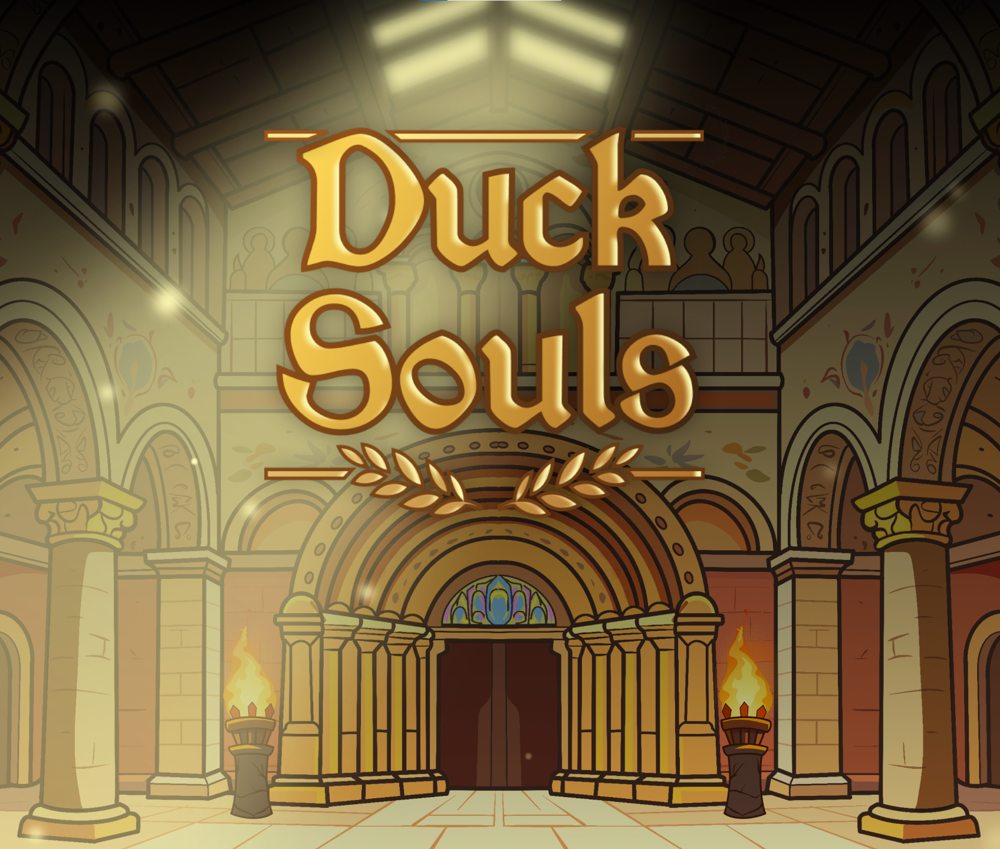

# Duck Souls
> A Cult of the Lamb–inspired, Roman-themed roguelike where you fight through 
> procedurally arranged dungeons as a sword-or-spear-wielding duck.

▶ [Play it on itch.io](https://pappmate25.itch.io/duck-souls)

## About
Duck Souls is a 2D top-down roguelike built solo in Unity, inspired by 
*Cult of the Lamb*'s dungeon-room-boss structure and dressed in a Roman 
visual theme. Players choose between a **melee sword** or **ranged spear** 
build, fight through multiple rooms per dungeon, and face a boss in the 
final room of each run. **The project's primary focus** was **clean engineering**: 
event-driven systems, ScriptableObject-based data, and strict separation 
of responsibilities.

## Design Highlights
- **Weapon-as-build-identity** — choosing sword (melee) or spear (ranged) 
  changes how every encounter plays.
- **Dungeon → room → boss structure** — short, contained encounters keep 
  pacing tight while preserving the roguelike escalation curve.
- **Procedural dungeon generation** — rooms and waves are assembled from 
  data-driven templates, so adding new content means editing a 
  ScriptableObject, not writing code.
- **Persistent progression between runs** — currency drops from enemies 
  feed a stat-upgrade system that persists across runs via a save layer.

## Engineering Highlights

This project's main goal was to practice clean architecture, not just ship 
features. Key patterns:

- **Event-driven player input** — `PlayerController` exposes events 
  (attack requested, dodge, aim direction) instead of directly invoking 
  systems. Keeps input completely decoupled from game logic.
- **ScriptableObject data layer** — `CharacterDataSO`, `WeaponDataSO`, 
  and `WavesSO` hold all tuning data. Designers (or future-me) can 
  rebalance the entire game without touching C# code.
- **Single Responsibility Principle** — `Health.cs` only manages HP and 
  fires events; `DamageDealer.cs` only deals damage; `RangedAttack.cs` 
  and `MeleeAttack.cs` listen for attack events and produce the attack. 
  Each script has one reason to change.
- **Bullet pooling** — projectiles are recycled rather than 
  instantiated/destroyed, keeping GC pressure low during heavy encounters.
- **Input action map swapping** — UI and gameplay use separate input 
  contexts, swapped via a central scene loader to prevent input bleed 
  between menus and combat.
- **UI built with Unity UI Toolkit** — main menu, pause menu, and 
  dungeon selector use the modern UXML/USS workflow rather than legacy 
  uGUI.

## Built With
- Unity 6 [6000.3.8f1]
- C#
- Unity UI Toolkit
- Unity Input System (action maps)

## Screenshots

## Controls
- **Move:** WASD
- **Aim:** Mouse
- **Attack:** Left Mouse Button
- **Dodge:** Left Shift
- **Interact:** E
- **Pause:** Esc

## Status
In active development. Current focus: dungeon and wave content, boss encounters, inventory + stats system, and visual polish.

*Built by Máté Papp — [[LinkedIn](https://www.linkedin.com/in/mate-papp25/)] | [[pappmate25.itch.io](https://pappmate25.itch.io/)]*
